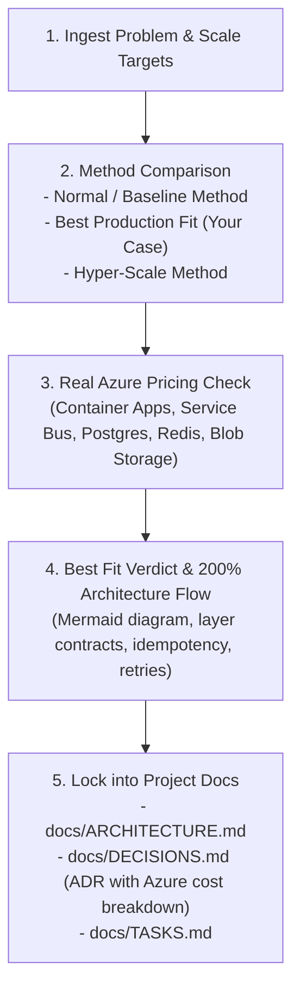

# Project Scaffold & Vibe Coding Workflow

Create, architect, and continuously maintain production-ready projects using the **Vibe Coding: Beginner-to-Production** workflow. This skill eliminates chaos, prevents scope creep, enforces architectural integrity, and scaffolds the **exact** feature-based or modular architectures for **Next.js**, **FastAPI**, and **React (Vite)**.

---

## The Core Philosophy: The Professional Vibe Loop

Never skip directly from:
$$\text{IDEA} \longrightarrow \text{AI} \longrightarrow \text{DEPLOY}$$

Instead, follow the complete production lifecycle:
$$\text{IDEA} \rightarrow \text{RESEARCH} \rightarrow \text{PRD} \rightarrow \text{STACK} \rightarrow \text{ARCHITECTURE} \rightarrow \text{DESIGN} \rightarrow \text{RULES} \rightarrow \text{TASKS} \rightarrow \text{SCAFFOLD} \rightarrow \text{FEATURE SLICES} \rightarrow \text{TEST} \rightarrow \text{PREVIEW} \rightarrow \text{PROD}$$

---

## Operating Modes

Choose the mode matching the user's intent:

| Mode | Trigger | Output |
|---|---|---|
| **Mode 1: Full Project Inception** | User has an idea or wants to start a project from scratch | 5-question intake brief, complete `docs/` suite, exact folder scaffolding, and initial `TASKS.md` |
| **Mode 2: Exact Architecture Scaffolding** | User specifies stack (Next.js, FastAPI, React, or Fullstack) | Creates the exact directory tree, placeholder files, barrel exports, configs, and types |
| **Mode 3: Documentation & AI Rulebook Initializer** | Existing project or docs-only setup | Generates `PRD.md`, `ARCHITECTURE.md`, `DESIGN.md`, `RULES.md`, `TASKS.md`, `DECISIONS.md`, `MEMORY.md`, `TEST_PLAN.md`, `SECURITY.md`, `.env.example` |
| **Mode 4: Vertical-Slice Feature Builder** | Implementing a feature in an active project | 6-part structured AI prompt, single-slice execution, automated testing, git commit, and doc sync |
| **Mode 5: Project Reopen & Resume Protocol** | User reopens an existing project or starts a new chat session | Reads `MEMORY.md`, `TASKS.md`, and `RULES.md`, states active status, aligns on next step, and updates docs upon completion |
| **Mode 6: 200% Production Architecture & Feasibility Engine** | User presents a technical problem or feature requirement in a new or existing project | Critiques naive patterns, checks internet standards & cloud pricing, provides 3-option trade-off matrix, designs 200% production flow, and documents in `docs/ARCHITECTURE.md` & `docs/DECISIONS.md` |

---

## Mode 1: Full Project Inception

### Step 1: The 5-Question Intake Brief
Before writing code or creating folders, ask these five questions (or extract them from the user's prompt):

1. **What problem are you solving?** (The core pain point)
2. **Who is the target user?** (Demographics, roles, audience)
3. **What is the main outcome?** (What success looks like for the user)
4. **What is the MVP?** (List only the absolute core features, e.g., Auth, Dashboard, Core Entity CRUD)
5. **What is explicitly OUT OF SCOPE for v1?** (e.g., No mobile app, no AI chat, no payments, no social feeds)

*Rule: Never proceed to code if items 1, 4, and 5 are undefined.*

### Step 2: Select the Tech Stack Architecture
Match the requirements to the exact architectural pattern:
- **Next.js (App Router, Feature-Based)**: Best for modern full-stack web apps, SEO-driven portals, SaaS platforms with SSR/SSG.
- **FastAPI (Modular Clean Architecture)**: Best for high-performance Python backends, AI/ML APIs, microservices, and database-intensive backends.
- **React + Vite (Feature-Based SPA)**: Best for client-heavy single-page applications, dashboards, or offline-capable apps paired with a separate API.
- **Fullstack (Next.js/React + FastAPI)**: Next.js or React frontend connected to a FastAPI backend.

### Step 3: Initialize Project Documentation
Create the `docs/` folder and root configuration markdown files:
- `docs/PRD.md` — Product Requirements Document (What & Why)
- `docs/ARCHITECTURE.md` — System architecture, flow diagrams, and architectural rules (How)
- `docs/DESIGN.md` — Typography, colors, spacing tokens, button/card specs, loading/empty/error states
- `docs/RULES.md` — AI rulebook for code style, input validation, and commit hygiene
- `docs/TASKS.md` — Phased atomic checklist (Setup $\rightarrow$ Auth $\rightarrow$ Feature Slices)
- `docs/DECISIONS.md` — Architectural Decision Records (ADRs)
- `docs/MEMORY.md` — Current active status, completed items, active task, blockers
- `docs/TEST_PLAN.md` — Acceptance criteria and responsive matrix (375px, 768px, 1440px)
- `docs/SECURITY.md` — Authentication, authorization guards, secret management, upload sanitization
- `.env.example` — Required environment variable keys without secrets
- `README.md` — Developer setup guide and run instructions

---

## Mode 2: Exact Architecture Scaffolding

You can scaffold the exact folder structures directly or invoke the built-in generator script:
```powershell
python scripts/scaffold.py --stack [nextjs|fastapi|react|fullstack] --name <project-name> --output-dir <path> [--with-docs]
```

### 1. Next.js App Router Architecture (`frontend/`)
Reference document: [nextjs-architecture.md](./references/nextjs-architecture.md)

Key structure highlights:
- `app/`: Next.js App Router routing layer with route groups:
  - `(public)/`: `layout.tsx`, `page.tsx` (landing), `about/page.tsx`, `contact/page.tsx`
  - `(auth)/`: `layout.tsx`, `login/page.tsx`, `register/page.tsx`, `forgot-password/page.tsx`, `reset-password/page.tsx`
  - `(dashboard)/`: `layout.tsx`, `dashboard/page.tsx`, `profile/page.tsx`, `settings/page.tsx`, `reports/page.tsx`
  - `(admin)/`: `layout.tsx`, `dashboard/page.tsx`, `users/page.tsx`, `roles/page.tsx`, `permissions/page.tsx`
  - `api/auth/route.ts`: BFF/API endpoints
  - `layout.tsx`, `loading.tsx`, `error.tsx`, `not-found.tsx`, `page.tsx`
- `features/`: Modular business domains (`auth`, `dashboard`, `profile`, `settings`, `users`, `reports`). Each feature contains:
  - `components/`, `hooks/`, `api/` (service, query, mutation), `store/`, `context/`, `validation/`, `utils/`, `types/`, `constants/`, `tests/`, and barrel `index.ts`.
- `components/`: Shared UI components (`ui/` with Button, Input, Card, Modal, Table, Select, Badge, Spinner; `common/` with Loader, EmptyState, ErrorMessage, ConfirmDialog; `layout/` with Navbar, Sidebar, Footer, Header).
- `services/`: API Axios client, endpoints, interceptors, WebSocket, Firebase.
- `hooks/`, `store/`, `lib/`, `context/`, `utils/`, `constants/`, `config/`, `types/`, `styles/`, `assets/`, `public/`, `tests/`.
- Root files: `middleware.ts`, `Dockerfile`, `.dockerignore`, `.env.local`, `.env.production`, `next.config.js`, `tsconfig.json`, `package.json`, `README.md`.

---

### 2. FastAPI Modular Domain Architecture (`backend/`)
Reference document: [fastapi-architecture.md](./references/fastapi-architecture.md)

Strict Layer Responsibilities:
| Layer | File / Directory | Responsibility |
|---|---|---|
| **Router** | `router.py` | Handles HTTP request/response, path/query validation, status codes, dependency injection |
| **Service** | `service.py` | Core business logic, domain rules, transaction coordination, validation |
| **Repository**| `repository.py`| Database operations, SQLAlchemy ORM queries, CRUD abstraction |
| **Models** | `models/` | DB table schema definitions (SQLAlchemy Base) |
| **Schemas** | `schema.py` | Pydantic V2 request & response serialization models |
| **Guards** | `dependency.py`| Route-level security dependencies, token parsing, RBAC guards |

Key structure highlights:
- `app/main.py`: Entrypoint
- `app/app_factory.py`: Application factory pattern
- `app/core/`: `config.py` (Pydantic Settings), `security.py` (hashing, JWT), `logging.py`, `events.py`, `exceptions.py`
- `app/db/`: `base.py` (DeclarativeBase), `session.py` (engine & sessionmaker), `models_import.py` (Alembic model aggregator)
- `app/modules/`: Feature modules (`auth/`, `users/`, `items/`), each strictly adhering to router $\rightarrow$ service $\rightarrow$ repository $\rightarrow$ models.
- `app/shared/`: `responses.py`, `pagination.py`, `constants.py`
- `app/dependencies.py`, `app/middleware.py`
- `alembic/`: Database migrations
- `tests/`: `unit/` and `integration/`
- Root: `requirements.txt`, `Dockerfile`

---

### 3. React + Vite Feature Architecture (`my-react-app/`)
Reference document: [react-vite-architecture.md](./references/react-vite-architecture.md)

Key structure highlights:
- `public/`: `favicon.ico`, `robots.txt`, `manifest.json`
- `src/features/`: Feature modules (`auth`, `dashboard`, `profile`, `settings`) containing components, hooks, api, types, store slices, utils, and context.
- `src/components/`:
  - `ui/`: `Button/`, `Input/`, `Modal/`, `Spinner/`, `Badge/` (each with `.jsx`, `.module.css`, `.test.jsx`, `index.js`)
  - `shared/`: `Navbar/`, `Footer/`, `Sidebar/`, `ErrorBoundary/`
  - `layout/`: `AuthLayout.jsx`, `DashboardLayout.jsx`, `PublicLayout.jsx`
- `src/hooks/`, `src/context/`, `src/services/` (`axiosClient.js`, `endpoints.js`, `firebase.js`, `socket.js`), `src/store/`, `src/types/`, `src/utils/`, `src/constants/`, `src/config/`, `src/routes/` (`AppRoutes.jsx`, `PrivateRoute.jsx`, `routesConfig.js`), `src/styles/`, `src/lib/`, `src/tests/`.
- Root files: `App.jsx`, `main.jsx`, `index.css`, `.env`, `.env.example`, `.gitignore`, `.eslintrc.cjs`, `.prettierrc`, `package.json`, `README.md`, `tsconfig.json`, `vite.config.js`.

---

## Mode 4: Vertical-Slice Feature Builder

When developing features in the scaffolded project, enforce vertical-slice delivery:

```
[Understand] -> [Plan] -> [Implement Single Slice] -> [Test] -> [Review] -> [Commit] -> [Sync Docs]
```

### The 6-Part Structured Prompt Template
Whenever instructing AI to code a feature:
1. **CONTEXT**: What product we are building + reference `docs/PRD.md`, `ARCHITECTURE.md`, and `RULES.md`.
2. **TASK**: Exactly one atomic feature task (e.g. `TASK-001: Implement Login Form UI`).
3. **FILES**: Exact list of files to touch (e.g. `features/auth/components/LoginForm.tsx`).
4. **CONSTRAINTS**: Never touch unrelated files, reuse existing components, validate inputs.
5. **ACCEPTANCE CRITERIA**: Clear checklist of what must work for the feature to be done.
6. **TESTING**: Type check, lint check, unit tests, and responsive verification.

---

## Mode 5: Project Reopen & Resume Protocol

Whenever you close a project and reopen it later in a new session:

### Step 1: Re-alignment & Reading Context
The AI assistant must immediately inspect the project state **before** taking action:
1. Read `docs/MEMORY.md` to identify:
   - Current status of the project.
   - What tasks were completed in previous sessions.
   - What is the active task and immediate next step.
   - Any active blockers or known issues.
2. Read `docs/TASKS.md` to see the roadmap phase and remaining items.
3. Read `docs/RULES.md` and `docs/ARCHITECTURE.md` to re-align on layer discipline and coding constraints.
4. Provide a quick summary to the user:
   > *"Resumed project [Name]. Current status: [Status from MEMORY.md]. Next scheduled task: [TASK-ID: Title]. Ready to proceed?"*

### Step 2: Implementation & Testing
- Work strictly on the active task identified in `MEMORY.md`.
- Follow the architectural boundaries (router $\rightarrow$ service $\rightarrow$ repository in FastAPI, or feature-slice in Next.js/React).
- Verify the change against `docs/TEST_PLAN.md` (unit tests, lint, typecheck, responsive checks).

### Step 3: Synchronize Documentation
Once the feature slice is verified and committed:
1. **`docs/TASKS.md`**: Mark the completed task `[x]`.
2. **`docs/MEMORY.md`**:
   - Move the completed task to "Completed Milestones".
   - Set the new active task and immediate next steps.
   - Note any new dependencies or issues discovered.
3. **`docs/DECISIONS.md`**: If any new technical choice was made, record an ADR.
4. **`docs/SECURITY.md`**: If any new auth route or sensitive data was introduced, document the security controls.

---

## Mode 6: 200% Production Architecture & Feasibility Engine

Use this mode whenever you bring a specific technical problem or feature (e.g., *"How do I implement real-time alerts for 100k users?"*, *"Design the payment webhook flow"*, *"What is the best architecture for this search problem?"*).

Reference document: [production-architecture-evaluation.md](./references/production-architecture-evaluation.md)

### The 5-Step Principal Architect Pass (Normal vs. Best Production Fit + Azure Pricing)



#### Step 1: Analyze the Given Problem
Extract the core problem, user volume, read vs. write ratio, latency tolerance, and security requirements.

#### Step 2: Architecture Method Breakdown
Contrast three clear methods:
1. **Normal / Baseline Method**: The quick, naive implementation commonly found in tutorials (e.g. processing synchronously in route handlers, unindexed table scans, basic polling). Point out exactly **why it fails in production**, where the bottleneck will choke, and what race conditions it creates.
2. **Best Production Fit (200% Recommended for Your Case)**: The battle-tested, resilient architecture designed specifically for your stack and use case (clean layer separation, async workers, cache-aside, idempotency, and graceful degradation).
3. **Hyper-Scale Method**: The extreme-scale distributed pattern (e.g. multi-region Kafka/Event Hubs, Cosmos DB globally distributed), and whether it represents costly over-engineering for your current stage.

#### Step 3: Microsoft Azure Pricing & Cost Feasibility Check
Go and check official Microsoft Azure pricing for the methods:
- **Compute**: Azure Container Apps (serverless consumption with free grant) vs. Azure App Service (Linux B1/P1v3) vs. Azure Functions.
- **Database**: Azure Database for PostgreSQL Flexible Server (Burstable B1ms vs General Purpose D2ds_v5) vs. Azure SQL.
- **Queuing & Messaging**: Azure Service Bus (Standard tier topics/queues with DLQ) vs. Azure Storage Queues.
- **Storage & Uploads**: Azure Blob Storage (Hot/Cool) with **SAS tokens** for direct browser uploads.
- **Caching**: Azure Cache for Redis (Basic C0 vs Standard C1).
- Provide a clear **Estimated Monthly Azure Cost Breakdown** at:
  - Starting volume (~1,000 active users)
  - Growth volume (~10,000 active users)
  - Scale volume (~100,000 active users)

#### Step 4: Best Fit Verdict & 200% Architecture Flow
Select the **Best Fit for your exact case** and produce:
- **Mermaid End-to-End Flow Diagram**: Complete client-to-cloud visual pipeline.
- **Layer Contracts**: Router $\rightarrow$ Service $\rightarrow$ Azure Service Bus $\rightarrow$ Worker $\rightarrow$ Database.
- **Resilience Specifications**: Idempotency keys, retry policy with exponential backoff, dead-letter queue (DLQ) handling, and cache invalidation.

#### Step 5: Lock into Project Documentation
Before writing implementation code:
1. Update **`docs/ARCHITECTURE.md`** with the new architecture flow and Azure component diagram.
2. Record an Architecture Decision Record (ADR) in **`docs/DECISIONS.md`** detailing the problem, the methods evaluated (Normal vs. Best Fit), and the Azure cost rationale.
3. Break down the implementation into atomic vertical slices in **`docs/TASKS.md`**.

---

## Pre-Deployment Verification Checklist

Before pushing to production or preview:
- [ ] **Code Hygiene**: Type checking passes (`npm run typecheck` or `mypy`), linting passes (`npm run lint` or `ruff`), automated tests pass.
- [ ] **UI States**: Mobile (375px), Tablet (768px), and Desktop (1440px) verified. Loading, empty, and error states present.
- [ ] **Security**: No secrets committed to Git, all endpoints protected server-side, all inputs validated.
- [ ] **Documentation**: `TASKS.md` and `MEMORY.md` updated with completed status and next steps.

---

## Reference Guides and Resources
- Detailed Next.js Blueprint: [nextjs-architecture.md](./references/nextjs-architecture.md)
- Detailed FastAPI Blueprint: [fastapi-architecture.md](./references/fastapi-architecture.md)
- Detailed React Blueprint: [react-vite-architecture.md](./references/react-vite-architecture.md)
- Complete Vibe Coding Methodology: [vibe-coding-workflow.md](./references/vibe-coding-workflow.md)
- Production Architecture Evaluation: [production-architecture-evaluation.md](./references/production-architecture-evaluation.md)
- Scaffolding Generator Script: [scaffold.py](./scripts/scaffold.py)
- Markdown Templates: [templates/](./templates/)

