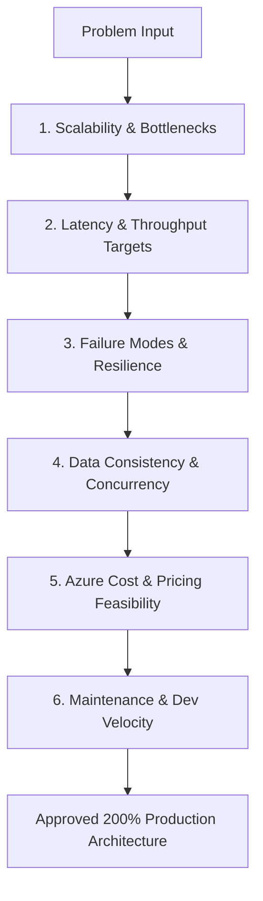

# Production Architecture Evaluation & Feasibility Framework (Azure Focus)

When building software that must survive real-world scale, never jump directly to code. Naive architectures create hidden tech debt, exponential cloud costs, and catastrophic downtime under load.

This reference guides the **Principal Architect Pass (200% Production Architecture)** with an **exclusive focus on Microsoft Azure services and Azure pricing**: how to critique bad architectures, research Azure solutions, evaluate Azure pricing tiers, and design bulletproof system flows before writing code.

---

## 1. The 6-Point Production Pressure Test

Before accepting any architectural design, stress-test it against these 6 criteria:



### 1. Scalability & Bottlenecks
- What happens at $10\times$, $100\times$, or $1,000\times$ current traffic?
- Where is the single point of contention? (e.g. single database table lock, unindexed queries, CPU exhaustion on web tier).

### 2. Latency & Throughput Targets
- Does the user request require synchronous completion (<200ms)?
- If work takes >500ms (PDF processing, image resizing, heavy aggregations, AI inference), it **must** be offloaded to an asynchronous background worker via **Azure Service Bus** or **Azure Storage Queues**.

### 3. Failure Modes & Resilience
- What happens when a 3rd party API goes down or times out? (Circuit breaker pattern, fallback cache, retry with exponential backoff).
- Are operations idempotent? If Azure Service Bus delivers a message more than once (at-least-once delivery), does it handle deduplication cleanly via message ID / idempotency keys?

### 4. Data Consistency & Concurrency
- Are race conditions possible? (e.g., booking inventory, wallet updates, simultaneous signups).
- Use database row-level locking (`SELECT ... FOR UPDATE`), optimistic concurrency control (`ETag` / version column), or distributed locks using **Azure Cache for Redis**.

### 5. Azure Cost & Pricing Feasibility (Azure Exclusive)
When evaluating cloud pricing, calculate estimated monthly cost exclusively on **Microsoft Azure**:
- **Compute**:
  - **Azure Container Apps (Consumption)**: Pay per vCPU-second and memory-second. Generous free grant (180,000 vCPU-seconds, 360,000 GiB-seconds free per month). Ideal for microservices, APIs, and background workers that scale to zero.
  - **Azure App Service (Linux B1 / P1v3)**: Predictable fixed cost for steady-state web APIs.
  - **Azure Functions (Consumption Plan)**: First 1 million executions free each month.
- **Database**:
  - **Azure Database for PostgreSQL (Flexible Server)**: Burstable B1ms (~$13–$15/mo) for development/MVP; General Purpose D2ds_v5 for production workloads with auto-scaling storage.
  - **Azure SQL Database**: Serverless tier (auto-pause enabled) vs Provisioned compute.
  - **Azure Cosmos DB**: Serverless tier (pay per Request Unit - RU/s) for high-throughput NoSQL.
- **Queuing & Messaging**:
  - **Azure Service Bus (Standard Tier)**: ~$10/mo base for topics/subscriptions with enterprise dead-lettering and deduplication.
  - **Azure Storage Queues**: ~$0.0004 per 10,000 transactions (ultra-low cost for basic FIFO task queues).
- **Caching**:
  - **Azure Cache for Redis (Basic C0 / Standard C1)**: ~$16/mo (Basic C0) up to ~$55/mo (Standard with replication).
- **Blob Storage**:
  - **Azure Blob Storage (Hot / Cool)**: ~$0.018/GB/month. Use **SAS (Shared Access Signature) tokens** for direct browser-to-Blob uploads to avoid proxying large payloads through the backend.
- **Network & Edge**:
  - **Azure Front Door (Standard)**: Global CDN, SSL termination, and WAF rules.

### 6. Operational Simplicity
- Prefer **Azure Container Apps** over Azure Kubernetes Service (AKS) unless managing a cluster of 50+ microservices. Keep ops overhead low.

---

## 2. Naive vs. 200% Azure Production Architecture Patterns

| Feature Area | Naive / Toy Pattern (Will Break) | 200% Production Pattern on Azure |
|---|---|---|
| **Background Processing** | Heavy loops or threads inside FastAPI/Next.js routes | Offload task message to **Azure Service Bus** $\rightarrow$ processed by worker running on **Azure Container Apps** |
| **File Uploads** | Sending 50MB files directly through the API server to local disk | Backend generates an **Azure Blob Storage SAS Token**; client uploads directly to Blob Storage; Blob triggers Event Grid |
| **Real-Time Updates** | Client polling database every 2 seconds | **Azure Web PubSub** or WebSockets on Azure Container Apps with **Azure Cache for Redis** pub/sub |
| **High-Read Queries** | Directly querying PostgreSQL with complex JOINs on every request | **Azure Cache for Redis** cache-aside pattern (Cache hit < 5ms; Cache miss queries DB & caches with TTL) |
| **Search & Filtering** | `LIKE '%term%'` unindexed table scans | PostgreSQL GIN Full-Text Search OR **Azure AI Search** for semantic / large-scale catalog search |
| **Rate Limiting** | Memory dict on single web node (bypassed on multi-node scale) | Distributed Sliding Window in **Azure Cache for Redis** |
| **Secrets & Keys** | Stored in `.env` files on production servers | **Azure Key Vault** managed identities; zero secrets hardcoded |

---

## 3. The 3-Option Azure Trade-off Evaluation Matrix

For every architectural problem, formulate 3 distinct options comparing exclusively Azure pricing and services:

```markdown
### Solution Options Comparison (Azure Cloud)

| Dimension | Option A: Pragmatic (Low Traffic / MVP) | Option B: 200% Recommended (Production Balance) | Option C: Hyper-Scale (High Concurrency) |
|---|---|---|---|
| **Azure Architecture** | Azure App Service (B1) + Azure Postgres Flexible (B1ms) | Azure Container Apps + Azure Postgres Flexible + Azure Service Bus + Azure Redis | Azure Container Apps (Autoscaled) + Azure Cosmos DB + Azure Service Bus Premium + Front Door |
| **Latency** | ~200–350ms | <50ms (Cached), ~120ms (Uncached) | <20ms globally |
| **Scale Capacity** | Up to 5,000 DAU | Up to 100,000+ DAU | 1,000,000+ DAU |
| **Estimated Azure Cost** | ~$25 – $40 / month | ~$60 – $120 / month | ~$350+ / month |
| **Dev Time** | 1–2 days | 2–4 days | 2–3 weeks |
| **Failure Risk** | Single server CPU throttling | High resilience, worker auto-recovery | Distributed orchestration overhead |
```

---

## 4. How to Record the Decision in the Project

Once the winning architecture is determined:

1. **`docs/ARCHITECTURE.md`**:
   - Add the Mermaid Sequence / Flow Diagram referencing the specific Azure services.
   - Document connection strings, SAS token generation, and retry policies.
2. **`docs/DECISIONS.md`**:
   - Create an ADR (Architecture Decision Record).
   - Document: Context, Azure Alternatives Evaluated, Winning Option, Azure Monthly Cost Estimate, and Justification.
3. **`docs/TASKS.md`**:
   - Break down implementation into atomic vertical slices (Azure resource provisioning $\rightarrow$ client SDK setup $\rightarrow$ service API $\rightarrow$ tests).
4. **`docs/TEST_PLAN.md`**:
   - Add failure injection, Azure queue retry, and load testing scenarios.
