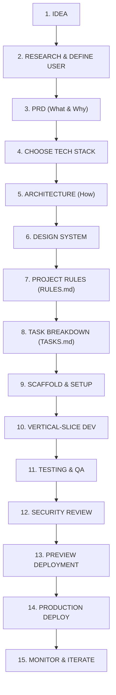

# The Vibe Coding Workflow: Beginner-to-Production Guide

This guide condenses the end-to-end methodology for building production-grade software using AI assistants. It prevents chaotic code generation, uncontrolled scope creep, and broken deployments by enforcing structured planning and incremental execution.

---

## 1. The Complete Production Lifecycle

Never skip directly from **IDEA $\rightarrow$ AI $\rightarrow$ DEPLOY**. The disciplined cycle is:



---

## 2. Project Inception: The 5 Essential Questions

Before opening the code editor or generating any code, answer:

1. **What problem are you solving?** (e.g., "College students struggle to organize assignments, notes, and deadlines.")
2. **Who is the user?** (e.g., "BCA, BSc CS, and BTech students.")
3. **What is the main outcome?** (e.g., "Give students one unified place to manage academic deadlines.")
4. **What is the MVP?** (List 4–6 core features: Auth, Dashboard, Notes, Assignments. Reject feature creep like AI tutors, gamification, payments, or mobile apps in v1.)
5. **What is explicitly OUT OF SCOPE?** (Write this down explicitly to stop AI from hallucinating extra layers.)

---

## 3. Project Documentation Framework

Before generating features, initialize these standardized context files in `docs/` or project root:

| File | Question Answered | Lifecycle Stage | Purpose |
|---|---|---|---|
| `PRD.md` | What are we building & why? | Planning | Scope definition, target user, MVP features, out-of-scope list, success criteria |
| `ARCHITECTURE.md` | How will the system work? | Planning | Tech stack, data flow, layer responsibilities, invariants |
| `DESIGN.md` | How should it look & feel? | Planning | Colors, typography, spacing tokens, button/card variants, UX states (loading, empty, error) |
| `RULES.md` | How must the AI code? | Planning | Code style, small functions, no editing unrelated files, input validation, small commits |
| `TASKS.md` | What do we build next? | Development | Phased, checkable checklist; work on one atomic task at a time |
| `DECISIONS.md` | Why did we make this choice? | Development | Architecture Decision Records (ADRs) to prevent AI from re-litigating technical choices |
| `MEMORY.md` | What is the current project state? | Development | Active task, completed milestones, known bugs, immediate next step |
| `TEST_PLAN.md` | How do we verify correctness? | Testing | Acceptance criteria, manual checklist, responsive breakpoints (375px, 768px, 1440px) |
| `SECURITY.md` | How do we protect user data? | Development | Auth verification, RBAC, input sanitization, no secrets in Git, file upload limits |
| `.env.example` | What config is required? | Setup | Key names only, zero secrets |
| `README.md` | How do humans use this project? | Documentation | Prerequisites, installation, local run commands, test commands |

---

## 4. Vertical-Slice Development

Do **NOT** build the entire frontend, then the entire backend, then the entire database. Build complete vertical slices of user value:

$$\text{User Action} \longrightarrow \text{UI Component} \longrightarrow \text{Service/API} \longrightarrow \text{DB Query} \longrightarrow \text{Render Result}$$

**Example Slice (Notes Feature)**:
1. `TASK-001`: Create notes table migration & model.
2. `TASK-002`: Create notes repository & CRUD service.
3. `TASK-003`: Create API endpoint for creating a note with validation.
4. `TASK-004`: Build Note creation form with loading & error states.
5. `TASK-005`: Wire UI form to mutation hook & verify note appears in list.
6. `TASK-006`: Add unit & integration tests, verify responsive UI, commit.

---

## 5. The 6-Part Structured Prompt for AI Coding

Whenever instructing the AI to implement a task, format the instruction with these 6 parts:

```markdown
CONTEXT:
We are building the student notes application.
Review docs/PRD.md, docs/ARCHITECTURE.md, and docs/RULES.md.

TASK:
Implement note creation (TASK-003).

FILES:
- frontend/features/notes/components/NoteForm.tsx
- frontend/features/notes/api/notes.mutation.ts
- frontend/features/notes/validation/note.schema.ts

CONSTRAINTS:
- Follow existing architecture.
- Reuse Button and Input from components/ui/.
- Do NOT create another database layer.
- Do NOT modify unrelated files.
- Validate input using Zod.

ACCEPTANCE CRITERIA:
- Logged-in user can submit a title and body.
- Title and body are required with clear validation messages.
- Submitting displays a loading spinner on the button.
- On success, note appears in the dashboard list.

TESTING:
- Run typecheck, lint, and relevant unit tests.
- Report all files changed and any follow-up tasks.
```

---

## 6. Structured Debugging Workflow

When an error occurs, avoid saying "fix this". Provide structured context:

1. **ERROR**: Exact error message, stack trace, and HTTP status code.
2. **EXPECTED BEHAVIOR**: What should have happened.
3. **ACTUAL BEHAVIOR**: What actually happened.
4. **STEPS TO REPRODUCE**: Numbered steps to trigger the bug.
5. **CONSTRAINTS**: e.g., "Do not change database schema", "Do not rewrite the router".
6. **DIAGNOSTIC FIRST**: Ask the AI:
   - What is failing?
   - Why is it failing?
   - Which file is responsible?
   - What is the smallest possible fix?
   - How will we test it?
7. Apply the surgical fix, verify tests pass, and commit.

---

## 7. Deployment Pipeline

Never treat Production as your first testing environment. Follow:

$$\text{Local Environment} \longrightarrow \text{Preview / Staging URL} \longrightarrow \text{QA Checklist} \longrightarrow \text{Production} \longrightarrow \text{Monitoring}$$

### Production Verification Checklist
- [ ] Authentication works on live domain (cookies, CORS, refresh tokens)
- [ ] Direct URLs & deep links resolve cleanly on page refresh (no 404s)
- [ ] Empty database state handled gracefully (EmptyState component rendered)
- [ ] Responsive layout verified at 375px (mobile), 768px (tablet), and 1440px (desktop)
- [ ] No `.env` or sensitive credentials committed in Git history
- [ ] Production build succeeds without TypeScript or lint warnings

