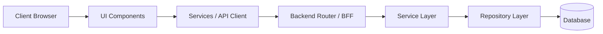

# System Architecture Document

## 1. Tech Stack
- **Frontend**: {{FRONTEND_TECH}} (Next.js App Router / React + Vite)
- **Styling**: Tailwind CSS
- **State Management**: React Query (server state) + Zustand / Redux Toolkit (client state)
- **Backend**: {{BACKEND_TECH}} (Next.js Server Actions / FastAPI)
- **Database**: {{DATABASE_TECH}} (PostgreSQL / SQLite)
- **ORM / Migrations**: {{ORM_TECH}} (Prisma / SQLAlchemy + Alembic)
- **Authentication**: {{AUTH_TECH}} (JWT / Supabase / NextAuth)

## 2. System Overview & Data Flow

## 3. Layer Separation & Invariants
1. **Routing Layer**: Solely handles routing, HTTP status codes, and layouts. No heavy business logic.
2. **Business / Service Layer**: Contains business rules, orchestration, and domain calculations.
3. **Data / Repository Layer**: Encapsulates database queries. UI never queries database directly.
4. **Validation**: All user inputs validated at application boundary using Zod or Pydantic.

## 4. Folder Structure
Refer to `references/nextjs-architecture.md`, `references/fastapi-architecture.md`, or `references/react-vite-architecture.md`.

