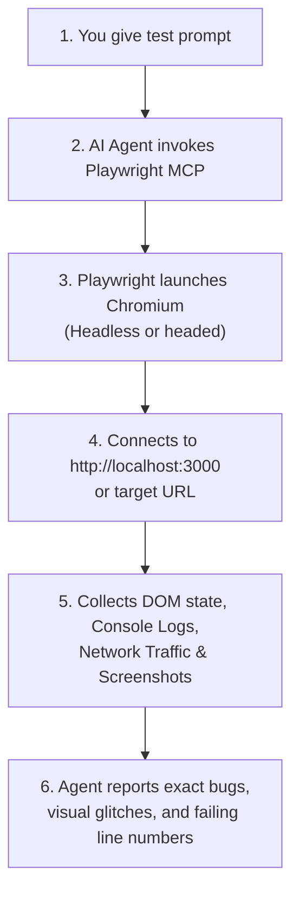

# Guide: `playwright-mcp` Skill

> **Skill Identifier**: `playwright-mcp`  
> **Source Location**: [`.agents/skills/playwright-mcp/`](../.agents/skills/playwright-mcp/SKILL.md)  
> **Package Bundle**: [`claude-upload/playwright-mcp.skill`](../claude-upload/playwright-mcp.skill)

---

## 1. What is this Skill?

The `playwright-mcp` skill equips AI agents (Google Antigravity and Claude) with live browser automation through Microsoft's official `@playwright/mcp` server.

Instead of only reading static code, the AI can:
- Open your running application at `http://localhost:3000` or `http://localhost:5173`.
- Click buttons, fill forms, and test user workflows end-to-end.
- Capture real screenshots at 6 responsive viewports (1920px down to 375px).
- Audit the browser console for uncaught JavaScript exceptions and React hydration warnings.
- Test scroll-scrubbed canvas and video animations.

```
BUILD → RUN → TEST → FIX → REPEAT
```

---

## 2. Quick Setup & Configuration

### A. Global Setup (Configured on your machine)
Configured in `C:\Users\<YOUR_USERNAME>\.gemini\config\mcp_config.json`:

```json
{
  "mcpServers": {
    "playwright": {
      "command": "npx",
      "args": [
        "@playwright/mcp@latest"
      ]
    }
  }
}
```

*(Note: We have already written this global configuration to your machine!)*

### B. Workspace Setup (Project-specific)
Add to `.agents/mcp_config.json` inside your project root.

---

## 3. How to Use this Skill (Prompt Library)

### Prompt 1: Initial Smoke Test (Harmless Public Demo)
> **You say**:  
> *"Use Playwright MCP. Navigate to https://demo.playwright.dev/todomvc. Verify that you can control the browser. Add a todo called 'Test Playwright MCP'. Mark it completed and take a screenshot. Do not modify any files in my project."*

### Prompt 2: Test Your Running Local App
> **You say**:  
> *"My dev server is running at http://localhost:3000. Open it with Playwright MCP. Do not modify files. Check page loading, console errors, broken images, and navigation buttons. Report issues with screenshots."*

### Prompt 3: 6-Point Responsive Viewport Audit
> **You say**:  
> *"Use Playwright MCP to test http://localhost:3000 at 1920x1080, 1440x900, 1024x768, 768x1024, 390x844, and 375x812. Check for horizontal overflow, text clipping, and navigation menu collapse. Take screenshots at desktop, tablet, and mobile breakpoints."*

### Prompt 4: Scrollytelling & Video Hero Test
> **You say**:  
> *"Open http://localhost:3000 with Playwright MCP and slowly scroll through the entire hero animation. Verify that image frames load without 404s, video scrubbing is smooth, and there are no console errors. Capture screenshots at 0%, 50%, and 100% scroll."*

---

## 4. What Happens Behind the Scenes?



---

## 5. What is the Exact Output?

When Playwright MCP completes a test run, you receive:
1. **Visual Screenshots**: High-resolution screenshots showing the actual rendered layout.
2. **Console Log Audit**: Any unhandled errors, warnings, or missing resource logs captured in the browser console.
3. **Network Failure Report**: Any 404s, 500s, or CORS failures captured during asset loading.
4. **Layout & Overflow Diagnosis**: Exact elements causing horizontal scrollbars or touch target issues.

---

## 6. Troubleshooting Diagnostics

| Issue | Cause | Fix |
|---|---|---|
| **Server not appearing** | Not saved inside `"mcpServers"` | Check `mcp_config.json` syntax and restart Antigravity. |
| **NPX not recognized** | Node.js not installed | Install Node.js LTS from nodejs.org and restart IDE. |
| **Browser launch timeout** | First-time download of Chromium | Run `npx playwright install chromium` manually in terminal. |
| **Connection refused** | Local dev server not running | Run `npm run dev` and verify `http://localhost:3000` loads first. |

