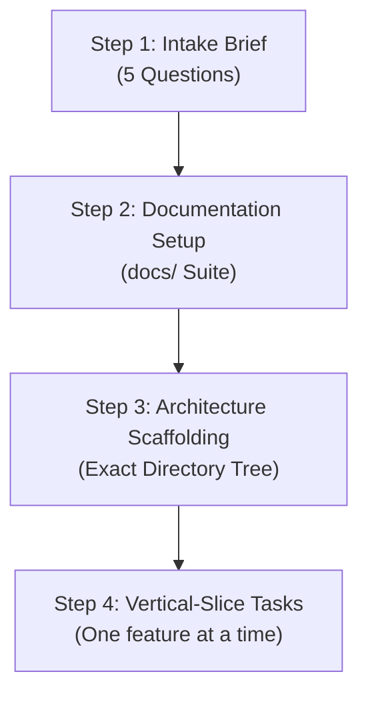
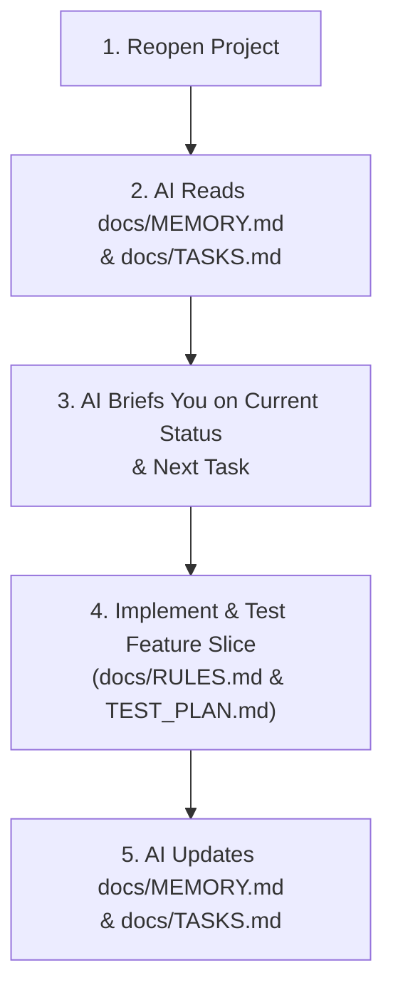

# Guide: `project-scaffold` Skill

> **Skill Identifier**: `project-scaffold`  
> **Source Location**: [`.agents/skills/project-scaffold/`](../.agents/skills/project-scaffold/SKILL.md)  
> **Package Bundle**: [`claude-upload/project-scaffold.skill`](../claude-upload/project-scaffold.skill)

---

## 1. What is this Skill?

The `project-scaffold` skill brings the complete **Vibe Coding: Beginner-to-Production** methodology into your AI assistant. It eliminates chaotic coding, prevents feature creep, enforces architectural integrity, and scaffolds production-ready folder structures for **Next.js**, **FastAPI**, and **React + Vite**.

Instead of allowing the AI to jump blindly from $\text{IDEA} \rightarrow \text{AI} \rightarrow \text{DEPLOY}$, it guides the process through structured planning, documentation, scaffolding, and vertical slices.

---

## 2. How to Use this Skill

### Method A: Natural Conversation in Antigravity or Claude

Simply ask the AI to start, create, or scaffold a project:

#### Example 1: Full Project Setup (Idea to Plan to Code)
> **You say**:  
> *"I want to create a new project called StudentHub. It's a platform for college students to manage assignments, deadlines, and class notes using Next.js. Use the project-scaffold skill."*

#### Example 2: Instant Folder Scaffolding (No Questions Asked)
> **You say**:  
> *"Scaffold the exact Next.js App Router frontend structure in `./frontend` with the feature-based architecture."*  
> *OR*  
> *"Scaffold the exact FastAPI clean architecture in `./backend` with router, service, repository, and models."*  
> *OR*  
> *"Scaffold the exact React Vite structure in `./my-react-app`."*  
> *OR*  
> *"Scaffold a fullstack Next.js + FastAPI application with project docs."*

#### Example 3: Initialize Docs for an Existing Project
> **You say**:  
> *"Set up the Vibe Coding docs and AI rules for my existing project."*

#### Example 4: Build Features Safely (Vertical Slices)
> **You say**:  
> *"Implement TASK-301: Create the Login and Signup forms under features/auth following the project rules."*

#### Example 5: 200% Production Architecture Pass (Azure Focused)
> **You say**:  
> *"I have a problem: I need to process PDF invoice uploads with OCR, extract data, and notify users in real-time. I already have my project structure. Don't write code yet. Critique naive approaches, check Microsoft Azure services and Azure pricing exclusively, give me a 3-option comparison, and design the 200% best production architecture flow on Azure."*

---

### Method B: Terminal / CLI Command
Run the built-in generator script directly without chatting:

```powershell
# Next.js App Router (frontend/) + full docs suite:
python d:\skills\.agents\skills\project-scaffold\scripts\scaffold.py --stack nextjs --name my-app --with-docs

# FastAPI Clean Architecture (backend/) + full docs suite:
python d:\skills\.agents\skills\project-scaffold\scripts\scaffold.py --stack fastapi --name my-api --with-docs

# React + Vite (my-react-app/) + full docs suite:
python d:\skills\.agents\skills\project-scaffold\scripts\scaffold.py --stack react --name my-client --with-docs

# Fullstack (frontend/ + backend/) + full docs suite:
python d:\skills\.agents\skills\project-scaffold\scripts\scaffold.py --stack fullstack --name my-app --with-docs
```

---

## 3. What Happens Behind the Scenes?

When this skill is activated, the AI executes a strict 4-step workflow:



### Step 1: The 5-Question Intake Brief
The AI gates the build by identifying:
1. What problem are you solving?
2. Who is the target user?
3. What is the main outcome?
4. What is the MVP? (core 4–6 features only)
5. What is explicitly OUT OF SCOPE for v1? (prevents AI hallucination)

### Step 2: Documentation Synthesis
The AI creates a `docs/` folder containing the project blueprint before touching any code.

### Step 3: Exact Tree Scaffolding
The AI creates the designated directories, configuration files (`tsconfig.json`, `package.json`, `.env.example`, `Dockerfile`, etc.), barrel exports, and starter code.

### Step 4: Vertical-Slice Task Execution
When coding features, the AI works one task at a time following the 6-part prompt framework (Context, Task, Files, Constraints, Acceptance Criteria, Testing), running lint and tests before committing.

---

### Step 5: Closing and Reopening the Project (Session Continuity)
When you close your IDE or start a new chat session days or weeks later:



1. **Re-grounding**: The AI reads `docs/MEMORY.md`, `docs/TASKS.md`, and `docs/RULES.md` before touching code.
2. **Status Briefing**: The AI tells you where the project left off:
   > *"Resumed project. Current status: Authentication completed. Next task: TASK-401 (Items database models and migration). Ready to proceed?"*
3. **Execution & Verification**: The AI develops the active task and runs verification tests.
4. **State Sync**: The AI automatically checks off the task in `docs/TASKS.md`, logs any ADRs in `docs/DECISIONS.md`, and updates `docs/MEMORY.md` with the new active task and next steps.

---

### Step 6: The 200% Production Architecture Pass (Exclusively Azure Pricing)
When you have a specific technical challenge in an existing or new project:
1. **Ruthless Critique of Naive Designs**: The AI identifies where simple approaches will break (CPU spikes, memory leaks, unindexed locks, race conditions, expensive API polling).
2. **Azure Standards & Cloud Pricing Check**: The AI evaluates cloud services and costs **exclusively on Microsoft Azure** (Azure Container Apps, Azure App Service, Azure Functions, Azure Database for PostgreSQL Flexible Server, Azure SQL, Azure Cosmos DB, Azure Service Bus, Azure Storage Queues, Azure Blob Storage with SAS tokens, Azure Cache for Redis, Azure Front Door).
3. **3-Option Azure Decision Matrix**: Compares **Option A (Pragmatic Azure MVP)** vs. **Option B (200% Recommended Azure Production)** vs. **Option C (Hyper-Scale Azure Enterprise)** across Latency, Scale Capacity, Monthly Azure Cloud Cost, Dev Time, and Failure Risk.
4. **The Winning Azure Production Flow**: Draws end-to-end Mermaid sequence/flow diagrams, defines idempotency strategies, caching TTLs, failure recovery (dead-letter queues on Azure Service Bus, exponential backoff retries), and layer boundaries.
5. **Lock Into Docs**: Automatically records the decision as an ADR in `docs/DECISIONS.md`, updates `docs/ARCHITECTURE.md`, and adds atomic tasks into `docs/TASKS.md`.

---

## 4. What is the Exact Output?

Depending on the stack selected, here is the exact output produced:

### 1. Project Documentation Suite (`docs/`)
Created whenever `--with-docs` or Mode 1/3 is triggered:

| File | Purpose | Contents |
|---|---|---|
| `docs/PRD.md` | Product Requirements Document | Problem statement, target users, goals, MVP scope, out-of-scope items, success criteria |
| `docs/ARCHITECTURE.md` | System Architecture | Tech stack, system overview, layer separation, invariants, Mermaid diagrams |
| `docs/DESIGN.md` | Design System | Typography, color tokens, button/card variants, required UX states (loading, empty, error) |
| `docs/RULES.md` | AI Rulebook | Type safety rules, small function size, strict file isolation, input validation, commit hygiene |
| `docs/TASKS.md` | Phased Task Matrix | Phased checkable task list from Setup $\rightarrow$ Auth $\rightarrow$ Feature Slices $\rightarrow$ Deploy |
| `docs/DECISIONS.md` | Architecture Decision Records | Permanent log of technical decisions (ADRs) |
| `docs/MEMORY.md` | Active Project State | Dynamic tracker of current status, active task, completed milestones, blockers |
| `docs/TEST_PLAN.md` | Verification Matrix | Acceptance criteria for auth and entities; 375px, 768px, 1440px responsive checklist |
| `docs/SECURITY.md` | Security Guidelines | Auth token security, RBAC checks, input sanitization, zero secrets in Git |
| `.env.example` | Config Template | All required environment variable keys with blank/dummy values |
| `README.md` | Developer Guide | Project overview and links to all documentation |

---

### 2. Next.js App Router Architecture (`frontend/`)
Scaffolded under `frontend/`:

```text
frontend/
├── app/                                          # Next.js App Router
│   ├── layout.tsx                                # Root layout (HTML, Body, Providers, Fonts)
│   ├── loading.tsx                               # Global loading UI
│   ├── error.tsx                                 # Global error boundary
│   ├── not-found.tsx                             # 404 page
│   ├── page.tsx                                  # Home page (/)
│   ├── (public)/                                 # Public route group
│   │   ├── layout.tsx, page.tsx, about/page.tsx, contact/page.tsx
│   ├── (auth)/                                   # Authentication pages
│   │   ├── layout.tsx, login/page.tsx, register/page.tsx, forgot-password/page.tsx, reset-password/page.tsx
│   ├── (dashboard)/                              # Protected user pages
│   │   ├── layout.tsx, dashboard/page.tsx, profile/page.tsx, settings/page.tsx, reports/page.tsx
│   ├── (admin)/                                  # Admin-only routes
│   │   ├── layout.tsx, dashboard/page.tsx, users/page.tsx, roles/page.tsx, permissions/page.tsx
│   └── api/auth/route.ts                         # BFF / API endpoint
│
├── features/                                     # Self-contained business modules
│   ├── auth/                                     # Components, hooks, api, store, context, validation, utils, types, tests, index.ts
│   ├── dashboard/                                # Widgets, hooks, api, store, utils, types, constants, index.ts
│   ├── profile/                                  # Profile UI, hooks, api, store, validation, utils, types, index.ts
│   ├── settings/                                 # Settings forms, hooks, api, store, utils, types, index.ts
│   ├── users/                                    # User management UI, hooks, api, store, types, index.ts
│   └── reports/                                  # Charts/tables, hooks, api, store, types, index.ts
│
├── components/                                   # Shared reusable UI
│   ├── ui/                                       # Button, Input, Card, Modal, Table, Select, Badge, Spinner
│   ├── common/                                   # Loader, EmptyState, ErrorMessage, ConfirmDialog
│   └── layout/                                   # Navbar, Sidebar, Footer, Header
│
├── services/                                     # Shared infrastructure (axios, endpoints, interceptors, websocket, firebase)
├── hooks/                                        # Global hooks (useDebounce, useLocalStorage, useWindowSize, etc.)
├── store/                                        # Global state (rootStore, global.store.ts)
├── lib/                                          # queryClient, auth, cookies, logger, date
├── context/                                      # ThemeProvider, NotificationProvider, AppProvider
├── utils/                                        # formatDate, formatCurrency, downloadFile, debounce, helpers
├── constants/                                    # routes, roles, permissions, app.constants
├── config/                                       # env, app.config, auth.config
├── types/                                        # api.types, common.types, global.d.ts
├── styles/                                       # globals.css, variables.css, theme.css, tailwind.css
├── assets/                                       # images, icons, fonts, animations
├── public/                                       # images, icons, favicon.ico, robots.txt
├── tests/                                        # setup.ts, mocks, e2e
├── middleware.ts                                 # Route protection middleware
├── Dockerfile, .dockerignore                     # Docker build instructions
└── next.config.js, tsconfig.json, package.json   # Next.js configurations
```

---

### 3. FastAPI Modular Clean Architecture (`backend/`)
Scaffolded under `backend/`:

```text
backend/
├── app/
│   ├── main.py                                   # Entrypoint
│   ├── app_factory.py                            # Factory pattern, CORS, router inclusions
│   ├── core/                                     # config.py, security.py, logging.py, events.py, exceptions.py
│   ├── db/                                       # base.py (Base), session.py (get_db), models_import.py
│   ├── modules/                                  # Business domains
│   │   ├── auth/                                 # router, service, schema, dependency, models/
│   │   ├── users/                                # router, service, schema, repository, models/ (user, profile, role)
│   │   └── items/                                # router, service, schema, repository, models/ (item, category)
│   ├── shared/                                   # responses.py, pagination.py, constants.py
│   ├── dependencies.py                           # Global dependency providers
│   └── middleware.py                             # Logging, auth middleware
├── tests/                                        # unit/, integration/
├── alembic/                                      # Database migrations
├── requirements.txt                              # FastAPI, Uvicorn, SQLAlchemy, Pydantic, Alembic
└── Dockerfile                                    # Python 3.11 container setup
```

**Strict Layer Table Enforced in FastAPI**:
| Layer | Responsibility |
|---|---|
| `router.py` | Handles HTTP request/response, validation, status codes, dependency guards |
| `service.py` | Business logic, workflows, domain validation, transaction coordination |
| `repository.py` | Database queries, CRUD abstraction, SQLAlchemy session access |
| `models/*.py` | SQLAlchemy database table definitions |

---

### 4. React + Vite Feature Architecture (`my-react-app/`)
Scaffolded under `my-react-app/`:

```text
my-react-app/
├── public/                                       # favicon.ico, robots.txt, manifest.json
├── src/
│   ├── assets/                                   # images, icons, fonts
│   ├── components/
│   │   ├── ui/                                   # Button, Input, Modal, Spinner, Badge (.jsx, .module.css, .test.jsx, index.js)
│   │   ├── shared/                               # Navbar, Footer, Sidebar, ErrorBoundary
│   │   └── layout/                               # AuthLayout, DashboardLayout, PublicLayout
│   ├── features/                                 # auth, dashboard, profile, settings (components, hooks, api, store, utils, context)
│   ├── hooks/                                    # useDebounce, useFetch, useLocalStorage, useWindowSize
│   ├── context/                                  # ThemeContext, NotificationContext
│   ├── services/                                 # axiosClient, endpoints, firebase, socket
│   ├── store/                                    # index.js, rootReducer.js, slices/globalSlice.js
│   ├── types/                                    # api.types, user.types, global.d.ts
│   ├── utils/                                    # formatDate, formatCurrency, validators
│   ├── constants/                                # routes, roles, apiConstants
│   ├── config/                                   # env, appConfig
│   ├── routes/                                   # AppRoutes.jsx, PrivateRoute.jsx, routesConfig.js
│   ├── styles/                                   # globals.css, variables.css, theme.js
│   ├── lib/                                      # queryClient.js
│   ├── tests/                                    # setupTests.js, mocks/handlers.js
│   ├── App.jsx, main.jsx, index.css              # React entrypoints
└── vite.config.js, package.json, tsconfig.json   # Vite and tooling config
```

